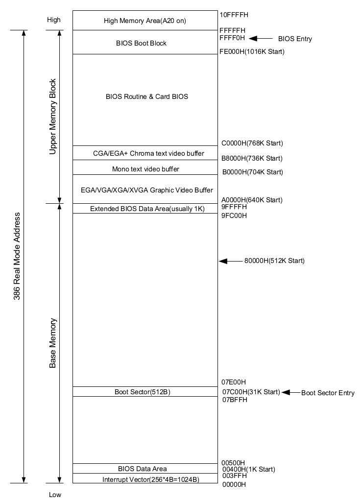

# 对实模式的探索

汇编语言的选择：nasm
原因：nasm使用及编译简单，之后操作系统代码中会使用GNU as
## 实模式的中断
### 清屏
可以参考下面实模式的内存空间分布图，在BIOS初始化后BIOS在00000H处建立了一个实模式下的中断向量表供编程使用。  
上卷全部行(清屏)中断
```asm

; 清屏使用0x06号功能，上卷全部行，实现清屏
; -------------------------------------
; INT 0x10   功能号:0x06   功能描述:上卷全部行
;--------------------------------------
; 输入:
; AH 功能号=0x06
; AL=上卷的行数(0表示全部)
; BH=上卷行属性
; (CL, CH)=窗口左上角(X, Y)位置
; (DL, DH)=窗口右下角(X, Y)位置
; 无返回值
```
### 获取光标位置
```asm
; 获取光标位置，使用0x3号子功能
; ------------------------
; INT 0x10   功能号:0x03  功能描述:获取光标位置
; 输入:
; AH 功能号=0x03
; BH=待获取光标的位置(第几页屏幕)
; 输出：
；CH=光标开始行
; DL=光标所在列号
```
### 打印字符串
```
; 打印字符串，使用0x13号子功能
； ------------------------------
； INT 0x10    功能号:0x13   功能描述:打印字符串
; --------------------------
; 输入:
; ES:BP=字符串首地址
; CX=串长度
; AH 功能号=0x13
; AL=写字符方式(光标跟随移动01h)
; BH=要显示的页号
; BL=字符属性(黑底绿字:02h)
```
### 读取硬盘
```
; INT 0x13读扇区使用调用参数设置如下:
; ah = 0x02  读磁盘扇区到内存		al = 需要读出的扇区数量;
; ch = 磁道(柱面)号的低8位;		cl = 开始扇区(位0~5),磁道号高2位(位6~7);
; dh = 磁头号；				dl = 驱动器号（如果是硬盘则位7要置位）；
; es:bx 指向数据缓冲区;	如果出错则CF标志置位,ah中是出错码.
```

## 实模式中断调用   
```
;nasm test.S -f bin -o test.bin
;dd if=test.bin of=hd60M.img bs=512 count=1 conv=notrunc
;bochs -f HLOS_bochsrc

SECTION code16 vstart=0x7c00;(也可以是ORG 0x7c00)

;此时cs = 0, ip = 0x7c00
;把所有的段寄存器全部修改为0x0，则只需要关注偏移
mov ax, cs
mov ds, ax
mov ss, ax
mov fs, ax
mov es, ax
mov sp, 0x7c00

;接下来是系统调用
mov ax, 0x0600
mov bx, 0x0700
mov cx, 0x0
mov dx, 0x184f
int 0x10

mov ah, 0x03
mov bh, 0x00
int 0x10

mov ax, message
mov bp, ax
mov cx, 5
mov ax, 0x1301
mov bx, 2
int 0x10

jmp $

message DB "hello"
times 510-($-$$) db 0
db 0x55, 0xaa
```
注意，这个时候假如去掉第一行的伪指令会发生什么呢?  
这个时候message的相对偏移为0x0033，而不是0x7c33，则会显示错误的字符
## 段基址+偏移
### 显卡基本知识
我们就在显存的位置放一些可视ASCII字符来进行寻址的探索。  
以下是i386实模式的内存空间分布图。



以下关于寻址的解释来自《操作系统真相还原》
寻址方式，从大方向来说分为三大类：  
* 寄存器寻址
* 立即数寻址
* 内存寻址
其中内存寻址有分为
* 直接寻址
* 基址寻址
* 变址寻址
* 基址变址寻址

什么是寻址：是CPU在寻找源或目的操作数的地址，也就是寻找到操作数的位置。  
操作数可能在寄存器中，也可能在指令中，或在内存中。

具体的显卡适配器相关信息待补充...
某些I/O接口也叫做适配器，适配器是驱动某一外设的功能模块。显卡也称为显示适配器，但是归根结底它就是一个I/O接口，专门用来连接CPU和显示器。我们想操作显示器，没有直接的方法，只有通过操作他的I/O接口——显卡。  
要对显卡进行编程，所具有的编程接口都是相同的——I/O端口和显存。  
显存是由显卡提供的，它是位于显卡内部的一块内存。显卡的工作就是读取这块内存并把内容发送到显示器。  
显卡也有自己的BIOS初始化，位置是上图的从0xC0000到0xC7FFF。   
显卡支持三种显示模式，文本模式，黑白图形模式，彩色图形模式。  
为了提升显卡的效率，x86设计者让显存映射到一部分内存位置，即下图位置(对应上图A0000H到C0000H)：  
  

### 显卡文本模式的使用
文本模式的显存从B8000H到BFFFFH共32KB大小，其中每个字符占2个字节，一个字节ASCII码，一个字节为ASCII码的显示属性。而一个屏幕一共可以显示2000个字符，4000B大小，故32KB/4000B为8个屏幕大小。

文本模式的ASCII显示占一个字节，其中3bit表示，3bit表示字符自己的颜色，另外两位控制颜色深浅与是否闪烁。

完整的字节图如下:  


其中颜色位与RGB的对应关系如下图:  


### 实践操作
```
;nasm test.S -f bin -o test.bin
;dd if=test.bin of=hd60M.img bs=512 count=1 conv=notrunc
;nasm test.S -f bin -o test.bin

SECTION code16 vstart=0x7c00;(也可以是ORG 0x7c00)

;此时cs = 0, ip = 0x7c00
;把所有的段寄存器全部修改为0x0，则只需要关注偏移
mov ax, cs
mov ds, ax
mov ss, ax
mov fs, ax
mov es, ax
mov sp, 0x7c00
mov ax, 0xb800;此时为0xb800而不是0xb8000是因为这是段基址，要向左位移4bit
mov gs, ax

;接下来是系统调用
mov ax, 0x0600
mov bx, 0x0700
mov cx, 0x0
mov dx, 0x184f
int 0x10

mov ah, 0x03
mov bh, 0x00
int 0x10

;0xA4->1010_0100表示红色字，闪烁绿色背景(对应之前的表)
mov byte [gs:0x00],'h'
mov byte [gs:0x01],0xA4

mov byte [gs:0x02],'e'
mov byte [gs:0x03],0xA4 

mov byte [gs:0x04],'l'
mov byte [gs:0x05],0xA4 

mov byte [gs:0x06],'l'
mov byte [gs:0x07],0xA4 

mov byte [gs:0x08],'o'
mov byte [gs:0x09],0xA4 

jmp $

times 510-($-$$) db 0
db 0x55, 0xaa
```
## A20测试